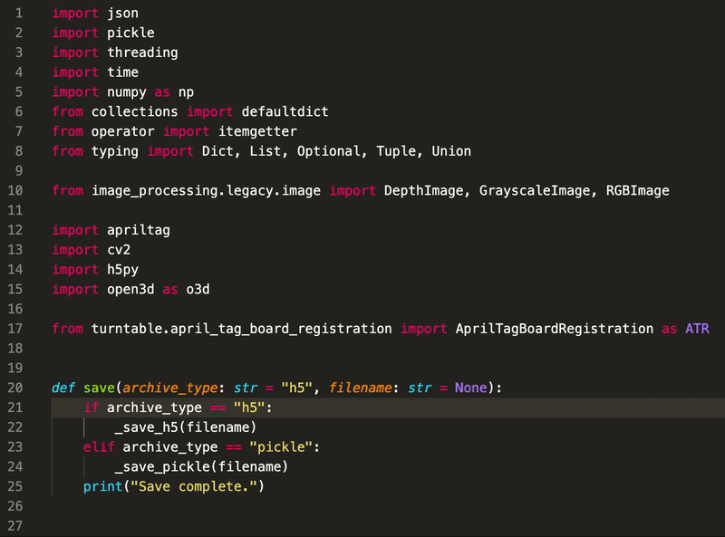

# reorder-python-imports

VSCode extension to sort and refactor python imports using [`reorder-python-imports`](https://github.com/asottile/reorder_python_imports).

Unlike other import organizers, `reorder-python-imports` focuses on reducing the frequency of merge conflicts, using static analysis to avoid the need for an active venv, and providing better better compatibility with `pre-commit` and `black`.

To learn more, [visit the original tool's homepage](https://github.com/asottile/reorder_python_imports).

## Features

Refactoring the imports is provided as a code action, which can be invoked by right clicking on the code or the lightbulb icon and selecting `Reorder Imports`, or selecting `Python Refactor: Reorder Imports` from the command palette.

## Requirements

`reorder-python-imports` must be installed in the venv used by visual studio.

## Known Issues

`isort` from Microsoft's Python Extension also provides a code action for organizing imports. When vscode is configured to organize imports on save, both `isort` and `reorder-python-imports` are run. Right now it isn't clear how to indicate which one should be used - please file an issue if you know the correct approach.

## Release Notes

### 0.0.1

Initial version with minimal required features - provided context menu and command through which the code action can be run.
